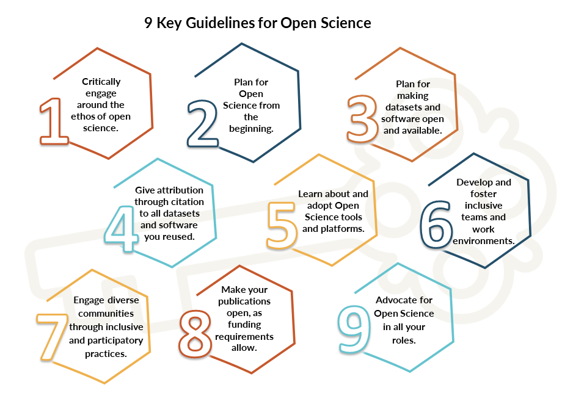

## Advocating for Open Science  

This module provides a broad overview of the Ethos of Open Science, the imperative for scientific and societal challenges and opportunities in the 21st century,  and an introduction to how you and your research team can begin to plan for and follow leading practices to enable Open Science.
Part of the ethos is to help enable these practices within your team and with your colleagues–that is, you are encouraged and empowered to share what you have learned and help them learn about, be aware of, and practice Open Science.

You will be participating in diverse scholarly efforts, including as a reviewer, in leadership positions at journals and societies, in organizing meeting sessions and meetings, and more.
Enabling Open Science is a broad cultural shift in scholarly practices worldwide.
In many ways, the recognition, reward and award systems in science are not fully aligned yet with Open Science as this cultural shift is ongoing.
You are encouraged to have conversations with colleagues  and help develop this culture broadly, and in all of these roles.

Here are nine key guidelines to start practicing and supporting Open Science and fostering an Open Science ethos:

1.	Critically engage **around the ethos of open science** and reckon with it in each new research context
2.	**Plan for Open Science** as you design your research. Discuss with your team and colleagues the Open Science practices you will integrate.
3.	**Plan for making datasets and software open** and available in scientific repositories and citing them in publications.
4.	**Give attribution** through citation to all datasets and software you reused from others. 
5.	**Learn** about and **adopt** Open Science tools and platforms
6.	**Develop** and foster inclusive teams and work environments
7.	**Engage diverse communities** through inclusive and participatory practices
8.	**Make your publications open** while ensuring requirements from your institution and funders are met
9.	**Advocate for Open Science** by informing your colleagues, supporting their use of open practices, and promoting leading practices around Open Science in all your roles.
