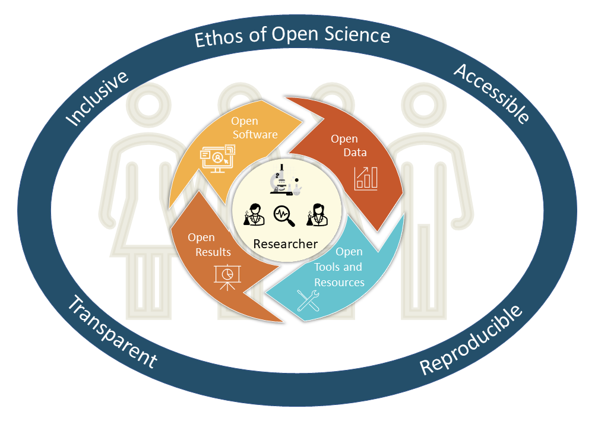

# TOPS OpenCore Module 1: Ethos of Open Science

Welcome to the TOPS OpenCore course on Open Science. OpenCore is a suite of five modules focused on how you, as a researcher, as well as your research team, can practice Open Science to improve science, your work, and its impact. Upon successful completion of this course, you will earn a TOPS OpenCore Badge. 

Start with _The Ethos of Open Science_ to get a foundation on Open Science and the numerous benefits to you and your team. The remaining modules can be taken in any sequence: _Open Data, Open Software, Open Results,_ and using _Open Science Tools and Resources_.

Open Science offers the most benefit when research communities both practice and intentionally integrate elements of Open Science with all aspects of research, from generating ideas to gathering funding to organizing your research team and its work, to sharing and sustaining that work, to presenting and publishing. These benefits are interconnected, so preparing for and practicing Open Science early is self-reinforcing.  The process is commonly described as the “research workflow” (as shown below).


The  four skill modules around data, software, results, and tools and resources are also  organized around this research workflow and are designed to give you information and practical activities to introduce and reinforce open practices at each stage.

Each of these modules is further empowered and enabled by Open Science communities of practice that can help you. In turn, “community” is embodied in how you build your research team and engage beyond it. Together these concepts form a connected “open science ecosystem” that enables Open Science.  As a researcher or research team (you) interact and connect with this entire ecosystem .  What is special about this open science ecosystem is that these components are interlinked, work together, interact, and complement each other, and provide a collective benefit to you and your team.  You (the learner) are going to develop the skills and knowledge to engage with the great variety of open science activities by taking this course. All together these concepts help form and enable, and are enabled by an open science ethos, the focus of the first module, which will also explain these interconnections.  Let’s begin there.




```{tableofcontents}
```
