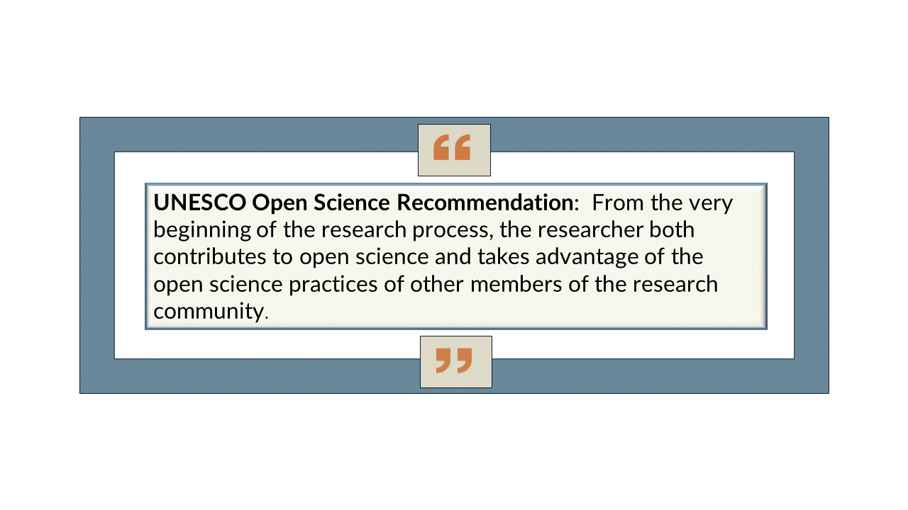

# Lesson 2.Toward an Open Science Ethos

You, and many researchers,  may think of Open Science as primarily following leading practices to provide for open access to your data, software, and publications.
Indeed, enabling these will make a huge contribution and provide many benefits to science and the public. However, the Ethos of Open Science embraces much more.
It is a mindset and approach to science, supported by a set of practices, that intentionally fosters inclusivity and equity in your research team and also engages others and invites their participation.
There are many advantages to having all your work open from the beginning or nearly so, to allow open collaboration, open input, and open access.
The Ethos of Open Science fosters this collaboration and input.

As researchers you can benefit from Open Science in many ways, but for Open Science to have the broadest impact, you also need to contribute to the larger ecosystem of Open Science through your research approaches by adopting open practices.
Further, we also need to ensure that each researcher has equitable opportunities to participate and contribute to the research ecosystem.
This means considering how people are excluded and taking intentional actions to increase inclusion and access. 

If you are new to Open Science, it may be uncomfortable to immediately open up all your work and approaches, or you may have resistance from your group and colleagues (some of this is discussed in lesson 5).
You and your colleagues may want to move more deliberately, using the guidance in these modules, and gain through experience.
This is understandable.
However, much of the approaches and practices in the Ethos of Open Science outlined below will improve your work, its impact and accessibility, and your teams’ approach to science regardless and are thus ready for adoption.

