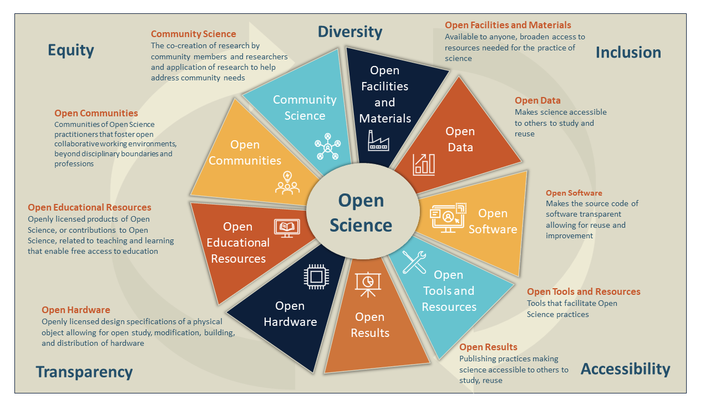

## Overview of Open Science

Open Science is not limited to a discipline or a particular aspect of scholarly practice. 
Rather, Open Science is increasingly foundational in every practice of scholarly work. 
**Open Science includes concrete practices, tangible open assets, and actionable values that foster open and inclusive research communities.**



Open Science begins with intentional planning and a commitment to practices that foster **diversity, inclusion and equity** and promote **transparency and accessibility**.  
**Open data** makes data accessible to others to study or to reuse in other pertinent projects. 
**Open hardware** includes the design specifications of a physical object, which are licensed in such a way that said object can be studied, modified, built and distributed by anyone, providing as many people as possible with the ability to construct, remix and share their knowledge of hardware design and function. 
**Open facilities and materials** are available to anyone without regard to nationality or institutional affiliation, broadening access to resources needed for the practice of science and in some cases accelerating scientific discovery. 
Open facilities and materials include telescopes, computing centers, museums (samples and specimens), reagents, assay, interactive cell modeling, and a variety of other existing resources that allow for reuse for additional research.  
**Open software** makes the source code of software transparent allowing people to use it and allowing for collaboration on improvement. 
**Open tools and resources** are tools that facilitate Open Science practices including everything from online toolkits, online collaboration and sharing tools to behavioral guideline recommendations that foster the practice and ethos of Open Science.

Open Science isn’t limited to research outputs and tools; **Open results** are essential to the transparent sharing of research and encompass the use of preprints to broadly share research outputs, from all stages of the research workflow, the publication of research in open access journals, and other sharing mechanisms that encourage open collaboration and broad attribution. 
**Open communities** are communities of practitioners that foster collaborative working environments, beyond disciplinary boundaries and professions, and **Community Science** is the co-creation of research by community members and researchers and application of research to help address community needs.
Open communities and community science both enable and contribute to Open Science through inclusive community practices, supporting transparent and accessible research, and collaborating with the public on science that is relevant and aligned to community needs. **Open Educational Resources** reflect products of Open Science, or contributions to Open Science, related to teaching and learning that are  openly licensed for reuse, repurposing and redistribution. 

`````{admonition} Activity: Open Resource Guide
:class: tip
Add content here
`````